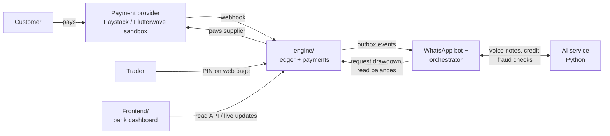

# VeriFlow

VeriFlow is an AI loan officer that lives in WhatsApp, turning market traders' everyday sales into verified financial records and working-capital credit from banks.

Built for the Zenith Bank Zecathon 6.0 hackathon (Smart SME Financing and Growth Platform challenge).

## How it works

1. Each trader gets her own **virtual account**. Every customer payment into it is a verified sale.
2. A fixed share of each payment (e.g. 10%) **automatically repays her loan**; the rest lands in her **wallet**.
3. When she needs stock, she orders it by voice in WhatsApp. Her **credit line pays the supplier directly**; the loan never becomes cash in her hand.
4. She approves every outgoing payment with a **PIN on a secure web page**, never inside WhatsApp.
5. Idle wallet money is **swept into savings** each night.
6. Bank staff watch everything on a **live dashboard**.

The demo loop: customer pays ₦5,000 → trader's virtual account → split (₦500 to loan, ₦4,500 to wallet) → ledger updates → WhatsApp confirmation → dashboard updates live.

## Repository layout

This is a monorepo: each part lives in its own folder, has its own stack, and deploys on its own. The parts talk to each other over HTTP.

| Role | Person | Folder / area | Stack | Status |
| --- | --- | --- | --- | --- |
| Financial engine: database, ledger, payments, loan and repayment logic | Adeyanju Fuhad | `engine/` | Next.js (TypeScript), Postgres on Supabase, Drizzle | In progress on `feat/financial-engine` |
| Product + WhatsApp: bot, commands, conversation flow | Amoo AbdulMueez | WhatsApp / orchestrator (folder to be agreed) | Next.js | Not pushed yet |
| AI: bookkeeping, voice understanding, credit analysis, fraud | Osuala Promise | `hackathon ai/` | Python 3.12, FastAPI, Groq / xAI | Source code not pushed yet |
| Bank dashboard: UI and real-time data | Satoye Olamide (Pulse dev) | `Frontend/` | Vite, React 19, Tailwind | On the `bank-dashboard` branch, not yet merged |
| Transaction records API (early prototype) | Osuala Promise | `backend/` | Express, MongoDB | On `main`; to be retired once `engine/` covers it |

## How the parts connect



- The **engine** is the only part that moves money or writes to the ledger.
- The **WhatsApp bot and AI agents** can read balances and *request* a drawdown, but can never approve one. Approval needs the trader's PIN on the web page.
- The **dashboard** reads from the engine's API (and Supabase Realtime for live updates).

Full API contract: `engine/docs/money-engine.md` (coming with the engine).

## Running locally

Each part has its own README with details.

**Dashboard** (on the `bank-dashboard` branch until merged):

```bash
cd Frontend
npm install
npm run dev
```

Set `VITE_API_BASE_URL` in `Frontend/.env` (see `Frontend/.env.example`).

**Transaction backend:**

```bash
cd backend
npm install
npm run dev
```

Runs on port 4000. Without `MONGODB_URI` it uses an in-memory MongoDB.

**Financial engine:** setup instructions arrive with `engine/`.

## Working together

- **Stay in your folder.** Change another person's folder only with their agreement.
- **Branch per piece of work:** `feat/...`, `fix/...`, `chore/...`. Merge into `main` through a pull request.
- **Never commit secrets.** Real values go in `.env` (ignored by git); commit a `.env.example` with placeholders.
- **Never commit dependencies.** `node_modules/` and Python virtualenvs are ignored. For Python, commit `requirements.txt` instead (`pip freeze > requirements.txt`).
- **Money amounts are integers in kobo** anywhere they cross between parts (₦5,000 = `500000`). Format to naira only for display.
